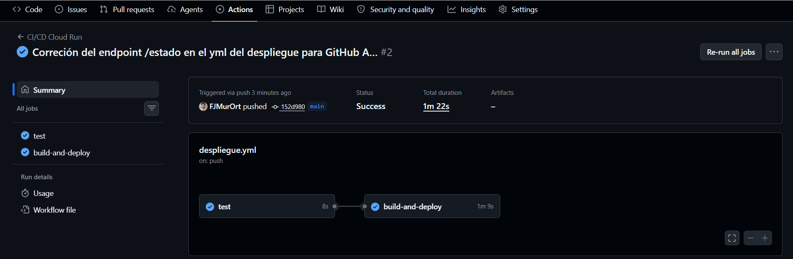
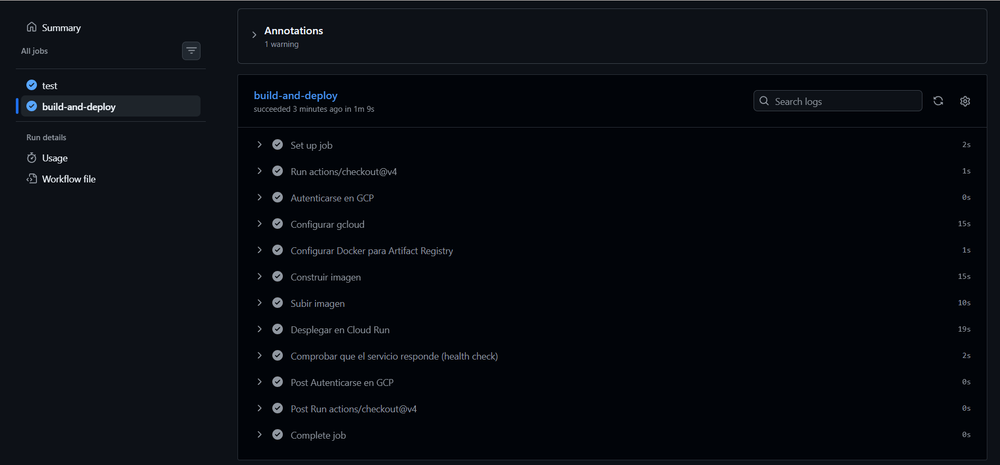
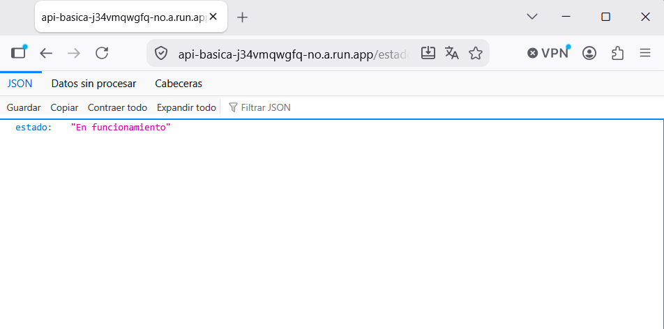
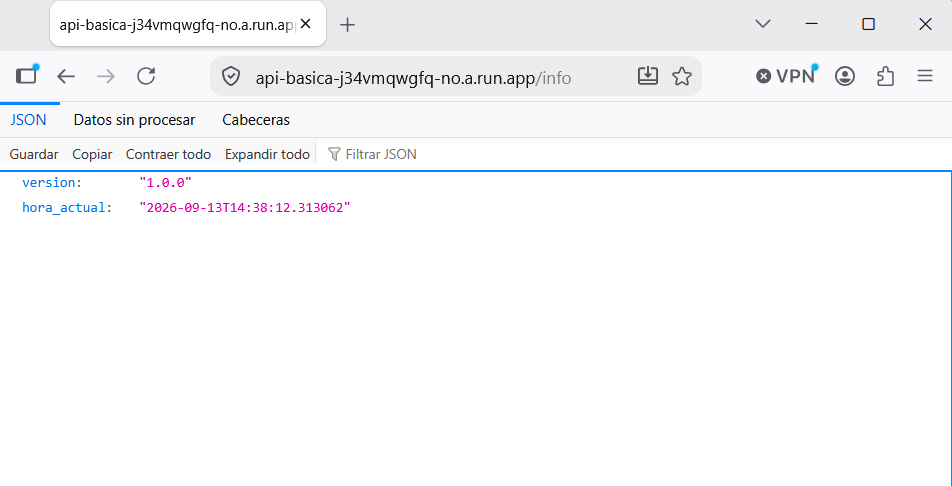
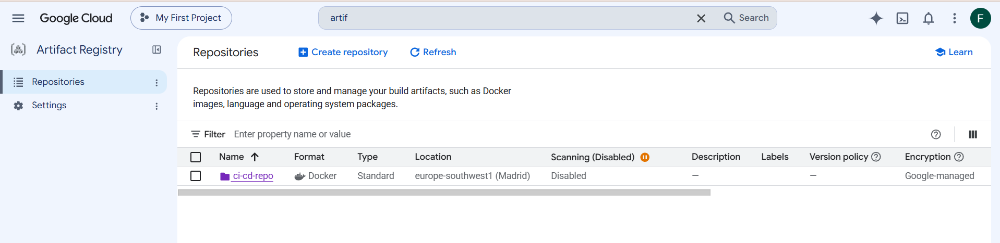
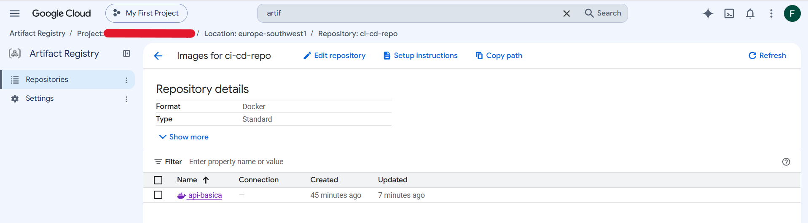
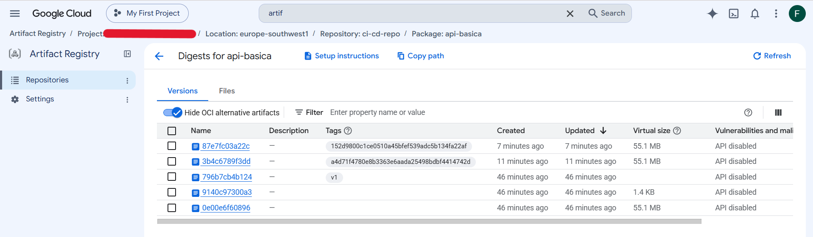
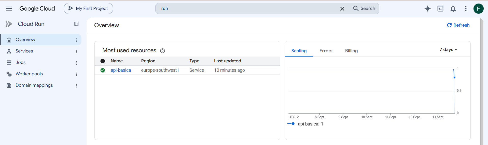
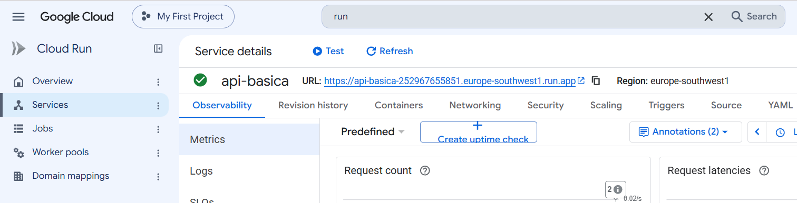
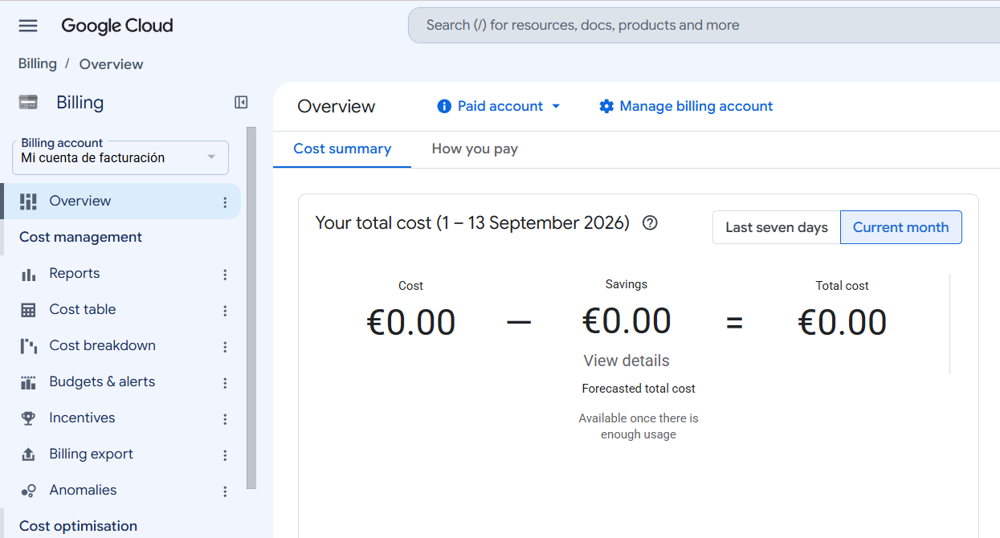

# CI/CD para despliegue en GCP (Cloud Run, Artifact Registry, Terraform, FastAPI y GitHub Actions)

Este proyecto es un pipeline completo de CI/CD que despliega automáticamente una aplicación en Google Cloud, desde el push a GitHub hasta que funciona en producción, con una URL pública.

## Lo importante: la API es solo la excusa

Aquí no le doy importancia realmente qué es lo que hace la aplicación (es una API muy básica) porque la idea de este proyecto es el despliegue en sí. Demuestro la creación de la infraestructura y automatización necesaria, desde mi repositorio hasta estar funcionando de verdad en la nube. La API es solo un elemnto que uso para mostrar el proceso, lo que de verdad importa es el despliegue en GCP.

## ¿Qué hace?

Cada vez que hago `git push` a `main`, esto pasa solo, sin que yo tenga que hacer nada más:

1. Se ejecutan los tests del yml
2. Se construye la imagen Docker
3. Se sube a Artifact Registry en GCP
4. Se despliega en Cloud Run
5. Y finalmente hace una petición al servicio para comprobar que funciona correctamente.

Si algo falla en cualquiera de estos pasos, el pipeline se detiene ahí. No se despliega una versión rota sin que yo lo sepa.

## ¿Por qué el tag de la imagen es el hash del commit y no algo fijo como "v1"? 

Así siempre puedo saber exactamente qué commit generó cada imagen que se desplegó, y nunca me arriesgo a sobrescribir una versión anterior sin querer.

## 🛠️ La infraestructura

Todo lo que hay en la nube lo crea Terraform:

- Un repositorio en Artifact Registry para guardar la imagen
- Un servicio de Cloud Run con acceso público

## 📸 Capturas












## 📁 Estructura

```
ci-cd-gcp-despliegue/
├── app/
│ ├── main.py
│ ├── requirements.txt
│ └── Dockerfile
├── terraform/
│ ├── main.tf
│ └── variables.tf
├── .github/
│ └── workflows/
│ └── despliegue.yml
└── README.md
```

## ⚙️ Si quieres probarlo tú mismo

1. Activa las APIs que se necesitan en tu proyecto de GCP:
```bash
   gcloud services enable run.googleapis.com artifactregistry.googleapis.com
```
2. Crea la infraestructura con Terraform:
```bash
   cd terraform
   terraform init
   terraform apply
```
3. Configura los secretos `GCP_SA_KEY` y `GCP_PROJECT_ID` en tu repositorio de GitHub para poder acceder a tu cuenta de GCP para el CI/CD con GitHub Actions
4. Haz un push a `main` para disparar el action

## 🛠️ Con qué está hecho

- Terraform
- Docker
- GitHub Actions
- Cloud Run
- Artifact Registry
- FastAPI (para el desarrollo de la api)

## 💰 ¿Cuánto ha costado?

Todo esto lo hice dentro del nivel gratuito de Google Cloud. Cloud Run no genera ningún coste, sólo si recibe mucho tráfico. Antes de empezar, puse una alerta de presupuesto de 1€ por si algo se salía de lo que tenía pensado. El gasto real y total fue de 0€.
